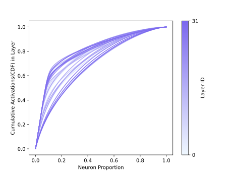

# Bamboo
We introduce Bamboo-v0.1, a new 7B LLM that boasts high sparsity while delivering performance equivalent to Mistral-7B. We hope our work can inspire more research on LLM sparsity and efficiency. In this repo, we provide the details of our model.

## Models

| Model                   | Transformers(HF)                                                           | PowerInfer/llama.cpp(GGUF)                                                       |
| ----------------------- | -------------------------------------------------------------------------- | -------------------------------------------------------------------------------- |
| **Bamboo-7B-base-v0.1** | [Bamboo-base-v0.1](https://huggingface.co/PowerInfer/Bamboo-base-v0.1)     | [Bamboo-base-v0.1-gguf](https://huggingface.co/PowerInfer/Bamboo-base-v0.1-gguf) |
| **Bamboo-7B-DPO-v0.1**  | [Bamboo-DPO-v0.1](https://huggingface.co/PowerInfer/Bamboo-Bagel-DPO-v0.1) | [Bamboo-DPO-v0.1-gguf](https://huggingface.co/PowerInfer/Bamboo-DPO-v0.1-gguf)   |

## Performance with different sparsity
Recent studies ([Zhang et al., 2024](https://arxiv.org/pdf/2402.03804.pdf)) have shown that the activation sparsity exists in LLMs by only keeping the top-k activation neurons in each layer. In this subsection, we show the performance of Bamboo with different sparsity with the same method. We evaluate the perplexity on wikitext-2-raw-v1. 

| Top-k Neurons      | PPL |
| ----------- | ----------- |
| 100%      | 6.484       |
| 20%   | 6.484        |
| 15%   | 6.485        |
| 12%   | 6.497        |
| 10%   | 6.524        |

## CDF of neurons distribution
Here we report the CDF of neurons distribution of Bamboo-7B-base-v0.1 for every FFN layer. We profile neurons' activation with [cosmopedia](https://huggingface.co/datasets/HuggingFaceTB/cosmopedia) dataset for around 1B tokens. 




## Performance Evaluation
Our evaluation is based on the framework lm-evaluation-harness. The evaluation details are listed as follows:

- Huggingface LLM Leaderboard tasks.
- Other Popular Benchmarks: We report the average accuracies on Big Bench Hard (BBH) (3-shot), HumanEval.

|         | MMLU   | Winogrande | TruthfulQA | Hellaswag | GSM8K  | Arc-C  | HumanEval | BBH  | Average |
| ------- | ------ | ---------- | ---------- | --------- | ------ | ------ | --------- | ---- | ------- |
| *Bamboo*    | 63.89 | 76.16     | 44.06     | 82.17    | 52.84 | 62.20 | 25.6     |  50.35    |    *57.1*     |
| Mistral | 62.65 | 79.24     | 42.62     | 83.32    | 40.18 | 61.43 | 26.21    |   56.35   |    56.5     |

## Speed Evaluation

https://github.com/SJTU-IPADS/Bamboo/assets/34213478/34c3024d-2dc1-4740-b12c-b26d82a5874d

<sub>Both PowerInfer and llama.cpp fully utilized the same hardware of Intel Core i7-13700 (8 threads) and Nvidia RTX 2080Ti (11GB).</sub>

Below is a detailed comparison of decoding speeds (tokens/second) achieved on Bamboo-7B-base with [PowerInfer](https://github.com/SJTU-IPADS/PowerInfer) and [llama.cpp](https://github.com/ggerganov/llama.cpp) across various hardware configurations.

| Scenario       | Hardware                            | with PowerInfer | with llama.cpp | Speedup |
| -------------- | ----------------------------------- | --------------- | -------------- | ------- |
| CPU+GPU Hybird | Core i7-13700(8T) + RTX 2080Ti(11GB) | 33.50           | 7.64           | 4.38x   |
| Full GPU       | RTX 4090(24GB)                       | 89.42           | 58.34          | 1.53x   |
| Full CPU       | Core i9-13900K(8T)                  | 9.09            | 4.78           | 1.90x   |

## Limitations
* Bamboo, having undergone training with only 200B tokens, may still exhibit performance gaps in certain tasks.
* The Bamboo model has only been trained on English-language datasets, hence its capabilities in other languages are still lacking.
* The model may produce unexpected outputs due to its small size and probabilistic generation paradigm.

## Future Work

- Mixtral8*7b level sparse activation model
- Better base and chat-7B model


## Citation
Please kindly cite using the following BibTeX:

```
@misc{bamboo,
    title={Bamboo: Harmonizing Sparsity and Performance in Large Language Models}, 
    author={Yixin Song, Haotong Xie, Zeyu Mi, Haibo Chen},
    year={2024}
}
```
